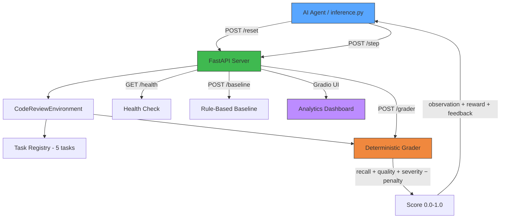

# Code Review OpenEnv Benchmark

## 🚀 Scaler March 2026 Hackathon Submission

**Author:** Dolphin-Syndrom
**Type:** OpenEnv Benchmark Environment
**Focus:** Evaluating LLM agents on security-aware code review tasks

---

## ⚡ TL;DR

A benchmark environment for evaluating LLM agents on taxonomy-driven pull-request reviews.

- **5 tasks** with progressive difficulty (extra_easy → easy → medium → hard → expert)
- **12-tag issue taxonomy** covering security, logic, and robustness flaws
- **Multi-dimensional grading**: recall + quality bonus + severity bonus − precision penalty
- **Iterative refinement**: feedback-driven multi-step improvement within episodes
- **32 unit tests** covering graders, environment lifecycle, and task coverage
- Deterministic scoring (0.0–1.0), deployable via Docker on Hugging Face Spaces
- Fully OpenEnv compliant

---

> Designed to evaluate whether AI agents can perform structured, taxonomy-driven code review under constrained interaction loops with iterative refinement.
>
> Suitable for benchmarking agent performance, reward shaping strategies, and detection accuracy without hallucinating false positives.

## What Makes This Environment Unique

### 1. Iterative Refinement Mechanic

Unlike single-shot evaluation environments, this benchmark provides **structured feedback after each step** that tells agents what categories of issues they missed (without revealing exact tags). This creates a genuine multi-step learning loop:

```
Step 1: Agent submits initial review → receives "Hint: look for security vulnerability"
Step 2: Agent refines review based on hint → finds missed sql_injection → score improves
Step 3: Final attempt with all accumulated feedback
```

This models how real code review works — reviewers iterate based on discussion and feedback.

### 2. Multi-Dimensional Reward Function

The grading system evaluates four orthogonal dimensions simultaneously:

| Component | Value | Signal |
|---|---|---|
| **Recall reward** | `|correct| / |planted|` | Comprehensive detection |
| **Quality bonus** | +0.05 per issue | Keyword-rich explanations |
| **Severity bonus** | +0.05 | Correct risk assessment |
| **Precision penalty** | −0.10 per FP | Anti-hallucination |

This forces agents to balance thoroughness against precision — a core tension in real code review.

### 3. Full 12-Tag Taxonomy Coverage

Every tag in the taxonomy is exercised across the 5 tasks:

| Category | Tags | Task Coverage |
|---|---|---|
| Logic errors | `null_pointer`, `missing_return`, `index_out_of_bounds` | extra_easy, easy |
| Security | `sql_injection`, `hardcoded_secret`, `path_traversal` | medium, expert |
| Robustness | `race_condition`, `timing_attack`, `improper_error_handling` | hard |
| Input handling | `type_error`, `integer_overflow`, `missing_input_validation` | expert |

## Architecture



## Environment Specification

### Objective

For each episode, the agent sees a Python code snippet containing planted issues and must:

1. Identify issues using tags from a 12-item `ISSUE_TAXONOMY`
2. Assess overall severity (`low`, `medium`, `high`, `critical`)
3. Articulate findings in a human-readable `review_comment`
4. Iteratively refine based on environment feedback across up to 3 steps

### Observation Space

| Field | Type | Description |
|---|---|---|
| `task_id` | string | Current task identifier |
| `file_name` | string | File under review |
| `task_description` | string | Review instructions |
| `code_snippet` | string | Python code with planted issues |
| `feedback` | string | Previous step feedback with refinement hints |
| `step_number` | integer | Current step (0 after reset) |
| `available_issue_tags` | array | Allowed taxonomy tags |

### Action Space

| Field | Type | Description |
|---|---|---|
| `issues_found` | list[str] | Tags from ISSUE_TAXONOMY |
| `severity` | enum | `low` / `medium` / `high` / `critical` |
| `review_comment` | string | Explanation of identified issues |

### Episode Flow

1. `reset(task_id)` loads a task and returns the initial observation
2. Agent receives code snippet and available tags
3. Agent submits review via `step(action)`
4. Environment returns observation with score, feedback, and refinement hints
5. Agent can use feedback to improve on subsequent steps
6. Episode ends when score ≥ 0.95 or step limit (3) reached

## Tasks

| Task | Difficulty | Planted Issues | File |
|---|---|---|---|
| `task_extra_easy` | Extra Easy | `index_out_of_bounds` | data_utils.py |
| `task_easy` | Easy | `null_pointer`, `missing_return` | user_service.py |
| `task_medium` | Medium | `sql_injection`, `hardcoded_secret` | auth.py |
| `task_hard` | Hard | `race_condition`, `improper_error_handling`, `timing_attack` | payments.py |
| `task_expert` | Expert | `path_traversal`, `integer_overflow`, `missing_input_validation`, `type_error` | file_processor.py |

## Reward Design

**Summary:** Correct behavior yields positive reward (~1.0), random strategies are penalized, ensuring meaningful learning signals.

The benchmark uses dense, shaped rewards so agents receive signal across the full trajectory instead of only at episode end.

Core components:

- **Recall reward**: fractional points for correctly identified issues
- **Quality bonus**: +0.05 per correct issue with a matching keyword in the comment
- **Severity bonus**: +0.05 when severity matches expected level for task difficulty
- **Precision penalty**: −0.10 for hallucinated or false-positive issues

## Project Structure

```text
.
├── __init__.py              # Package exports
├── client.py                # WebSocket client for agent interaction
├── models.py                # Typed Pydantic models (Action, Observation, State)
├── inference.py             # Baseline inference script with LLM + rule fallback
├── openenv.yaml             # OpenEnv specification
├── pyproject.toml           # Project config with pytest setup
├── requirements.txt         # Pip dependencies
├── Dockerfile               # Production container with health check
├── conftest.py              # Pytest root configuration
├── README.md
├── scripts/
│   └── validate-submission.sh
├── server/
│   ├── __init__.py
│   ├── app.py               # FastAPI + Gradio dashboard
│   ├── code_review_env_environment.py  # Environment with iterative refinement
│   ├── graders.py            # Multi-dimensional deterministic grader
│   ├── tasks.py              # 5 task definitions with planted issues
│   ├── requirements.txt
│   └── Dockerfile
└── tests/
    ├── conftest.py
    ├── __init__.py
    ├── test_graders.py       # 19 grader tests
    └── test_environment.py   # 13 environment lifecycle tests
```

## Setup

```bash
uv sync --frozen
# OR:
pip install -r requirements.txt
pip install -r server/requirements.txt
```

## Running

### Start the server

```bash
uv run uvicorn server.app:app --host 0.0.0.0 --port 8000
```

### Run tests

```bash
uv run pytest tests/ -v
```

### Run baseline inference

```bash
export API_BASE_URL=https://router.huggingface.co/v1
export MODEL_NAME=Qwen/Qwen2.5-72B-Instruct
export HF_TOKEN=your-token
python inference.py
```

## Docker

```bash
docker build -t code-review-openenv -f Dockerfile .
docker run -p 8000:8000 code-review-openenv
```

## 🔌 API Endpoints

| Method | Endpoint | Description |
|---|---|---|
| `GET` | `/health` | Health check |
| `GET` | `/tasks` | List all tasks with schemas |
| `POST` | `/reset` | Reset environment for a task |
| `POST` | `/step` | Submit a review action |
| `GET` | `/state` | Get current episode state |
| `POST` | `/grader` | Score a review against a task |
| `POST` | `/baseline` | Run rule-based baseline |

## Validation

```bash
openenv validate .
./scripts/validate-submission.sh http://localhost:8000 .
```

## 🏁 Submission Status

-  All 5 OpenEnv validation checks passing
-  32/32 unit tests passing
-  Docker build and deployment verified
-  End-to-end inference and grading pipeline tested

---

## 🔗 Links

- GitHub: https://github.com/Dolphin-Syndrom/code-review-env
- Hugging Face Space: https://huggingface.co/spaces/Dolphin-Syndrom/code-review-env

## License

BSD-3-Clause
